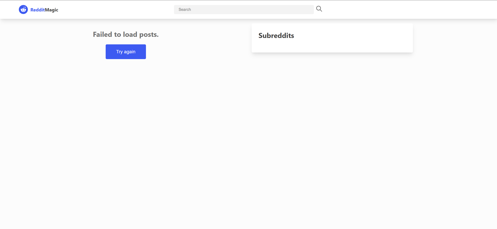

# Reddit Magic

A React web application that allows users to browse, search, and interact with Reddit posts using the Reddit API.

## Features

- **Browse Subreddits**: View posts from popular or custom subreddits
- **Search Posts**: Search Reddit posts by keywords
- **View Post Details**: See post content, comments, and metadata
- **Sort & Filter**: Sort posts by relevance, new, top, or hot
- **State Management**: Uses Redux store and Redux Thunks for async actions
- **Responsive Design**: Works well on desktop and mobile devices

## Technologies Used

- **React**: Built using functional components and hooks
- **Redux & Redux Thunks**: State management and async logic
- **CSS Modules**: Modular styling for components
- **Reddit API**: Integration for fetching posts and comments
- **Fetch API**: For making HTTP requests
- **GitHub**: Version control and project hosting

## What I Learned

Throughout this project, I gained experience with:

- Building a multi-component React application
- Managing global state with Redux and Redux Thunks
- Fetching and displaying data from a public API
- Handling asynchronous operations and loading states
- Implementing search and filter functionality
- Responsive web design principles
- Version control with Git and GitHub

## Areas for Improvement

1. **API Implementation**:
   - Improve error handling for API requests
   - Explore advanced Reddit API features (e.g., authentication, voting)
2. **Testing**:
   - Add unit tests for components and Redux logic
   - Implement integration tests for API calls

## Future Enhancements

- [ ] User authentication for voting and commenting
- [ ] Infinite scrolling or pagination
- [ ] Dark mode support
- [ ] Comprehensive testing suite
- [ ] Improved mobile experience
